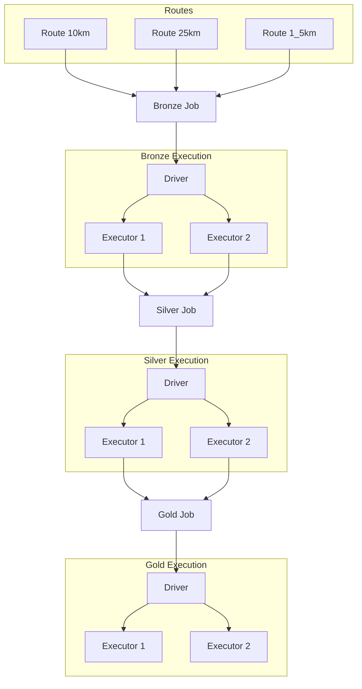

# Functional Programming & Distributed Data Processing Demo

> **Course:** Functional Programming (Academic Year 2025)  
> **Institution:** School of Information Technology, King Mongkut's Institute of Technology Ladkrabang (IT KMITL)  
> **Status:** 🟢 Active Demo Project

## 📖 Overview

This repository serves as a comprehensive demo project for students in the **Functional Programming** course. It bridges the gap between theoretical Functional Programming (FP) concepts and real-world **Distributed Data Processing** systems.

งานนี้ถูกออกแบบมาเพื่อเชื่อมโยงแนวคิดเชิงทฤษฎีของ **Functional Programming (FP)** เข้ากับระบบ **Distributed Data Processing** ที่ใช้งานจริงในอุตสาหกรรม
โดยที่โจทยมาจากงาน KMITL DANCHANG Trail 2025 ที่มีหลายระยะ และมีข้อมูลจากหลายแหล่งที่ ไม่สมบูรณ์ (Incomplete) และ ไม่สอดคล้องกัน (Inconsistent)

## 🧩 Problem Scenario | โจทย์ปัญหา

ในงานวิ่งมีทั้งหมด **3 ระยะทาง**

* 🏃 5 KM
* 🏃 15 KM
* 🏃 20 KM

### 📥 Data Sources

1. **Excel File (`excel.xlsx`)**

   * ใช้เป็น **Ground Truth**
   * มีข้อมูลผู้สมัคร + ระยะที่ลงทะเบียน

2. **IoT Timing System (API)**

   * เก็บข้อมูลจากการ **Scan จุดเช็คพอยต์**
   * มีปัญหา:

     * ❌ Scan ผิดระยะ (เช่น วิ่ง 10 km แต่ไป scan 25 km)
     * ❌ ข้อมูลหาย (Missing events)
     * ❌ Event ไม่ครบลำดับหรือลำดับผิด
     * ❌ Scan ซ้ำๆใน checkpoint เดิม

## ⚠️ Key Challenges

* Data **Missing / Incomplete**
* Data **Inconsistent across sources**
* **Human error** from checkpoint scanning
* Need **deterministic rule** for conflict resolution

## ✅ Business Rule (Critical Logic)

> 🧠 **Excel > IoT (Priority Rule)**

* ใช้ Excel เป็น **Source of Truth**
* IoT ใช้สำหรับ:

  * ตรวจสอบเวลา (Timing)
  * เติม event ที่ขาด (Enrichment)

### ตัวอย่าง:

| Case                    | Result                   |
| ----------------------- | ------------------------ |
| Excel = 5km, IoT = 15km | ✅ ใช้ 5km                |
| Excel ไม่มี, IoT มี     | ⚠️ ใช้ IoT แบบ tentative |
| IoT scan ผิด checkpoint | ❌ discard                |

## 🎯 Learning Objectives
By completing this project, students will be able to:

1.  **Model Data Pipelines as Functional Transformations**  
    ออกแบบท่อส่งข้อมูลโดยมองว่าเป็นการแปลงค่า (Transformations) ทางฟังก์ชัน
2.  **Understand Immutability in Distributed Systems**  
    เข้าใจว่าความไม่เปลี่ยนแปลงของข้อมูล (Immutability) ช่วยลดความซับซ้อนในการ Reasoning ระบบกระจายอย่างไร
3.  **Implement Declarative ETL Workflows**  
    สร้างกระบวนการ ETL แบบ Batch โดยใช้ระบบ Workflow แบบ Declarative
4.  **Orchestrate Jobs on Kubernetes**  
    Deploy และจัดการ Distributed Jobs บน Kubernetes Cluster
5.  **Apply Algebraic Reasoning to Real Systems**  
    เชื่อมโยงเหตุผลทางพีชคณิต (Algebraic Reasoning) เข้ากับระบบ Distributed จริง

## 🛠 Technology Stack | เครื่องมือและเทคโนโลยี

| Category | Tools | Description |
| :--- | :--- | :--- |
| **Orchestration** | Kubernetes, K3s, Kind | Container Orchestration (Production vs. Local) |
| **Workflow** | Argo Workflows | Declarative DAG-based job scheduling |
| **Compute Engine** | Apache Spark 4.x | Distributed data processing engine |
| **Spark Runtime** | Spark Operator | Kubernetes-native Spark application controller |
| **FP Runtime** | Cats Effect 3 | Explicit effect modeling & referential transparency |
| **Language** | Scala 2.13 | Functional-first JVM language |
| **Storage** | AWS S3 | Object storage for data lake |
| **Storage Format** | Apache Parquet | Columnar immutable analytical format |
| **Container** | Docker, Containerd | Application packaging & isolation |

### Infrastructure Notes | โน๊ตสำหรับโครงสร้างพื้นฐาน
*   **Production/Cluster:** ใช้ **Kubernetes** หรือ **K3s** สำหรับ Lightweight cluster
*   **Local Development:** ใช้ **Kind (Kubernetes in Docker)** เพื่อความรวดเร็ว ไม่ต้องพึ่งพา VM ของ Cloud Provider

## 🏗 Architecture & Concepts | สถาปัตยกรรมและแนวคิด

The system architecture is designed around the **Dataflow Graph** paradigm.
สถาปัตยกรรมระบบถูกออกแบบโดยยึดหลัก **Dataflow Graph**

### Core Methodology | วิธีการหลัก
*   **DAG Execution Model:** งานถูกกำหนดเป็น Directed Acyclic Graph ซึ่งแต่ละขั้นตอนขึ้นอยู่กับผลลัพธ์ของขั้นก่อนหน้า
*   **Pure Asynchronous I/O:** การรับส่งข้อมูลเป็นแบบ Non-blocking และไม่มี Side Effect
*   **Parallel & Concurrent:** แต่ละ Node ใน DAG เปรียบเสมือน Function ที่บริสุทธิ์ (Pure Function) สามารถประมวลผลแบบขนานได้
*   **Declarative Pipelines:** กำหนด "สิ่งที่ต้องการ" (What) แทน "วิธีการทำ" (How) ใน Workflow

## 📚 Resources & References | แหล่งเรียนรู้เพิ่มเติม
*   [Functional Programming Principles in Scala](https://www.coursera.org/learn/progfun1)
*   [Apache Spark Programming Guide](https://spark.apache.org/docs/latest/)
*   [Argo Workflows Documentation](https://argoproj.github.io/argo-workflows/)
*   IT KMITL Functional Programming Course Slides (Internal)

## 🤝 Contributing | การมีส่วนร่วม
โครงการนี้เปิดรับ Contribution จากนักศึกษาในรายวิชา หากพบข้อผิดพลาดหรือมีข้อเสนอแนะ กรุณาสร้าง Issue หรือ Pull Request

## 📄 License
This project is licensed under the **MIT License** - see the [LICENSE](LICENSE) file for details.
**Created for IT KMITL | Academic Year 2025**
